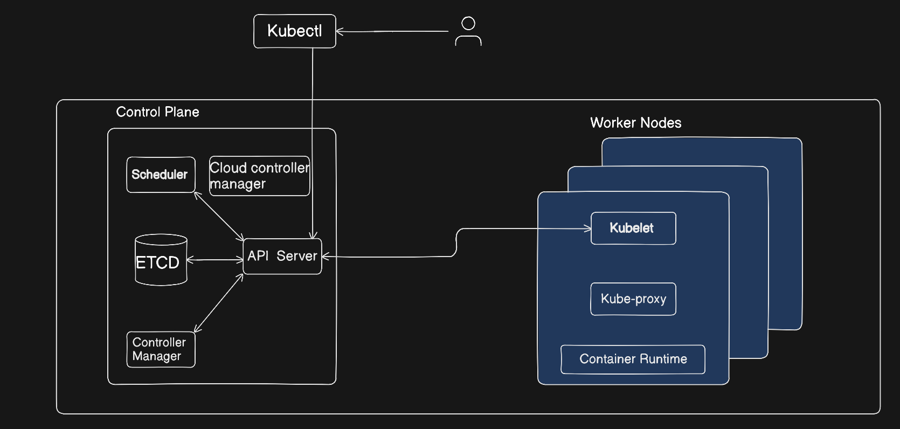

# **Creating an Amazon EKS cluster via AWS Console (IAM roles/users, access entries)**
<!-- > **Allowing multiple users to access it (IAM roles/users, access entries)** -->

>In this video, we’ll walk through the complete, beginner-friendly way to create an Amazon EKS cluster directly from the AWS Management Console, without using Terraform, eksctl, or any automation tools. We’ll purposely use the default VPC to keep the setup simple, but we’ll still follow AWS best practices wherever possible, including using the EKS API, assigning fine-grained IAM roles and policies, and controlling exactly which users and groups can access the cluster with admin or limited permissions.

>This guide is designed for beginners who want to understand how EKS works under the hood before moving on to production-grade setups. In later videos in this series, we’ll build on this foundation to create a fully production-ready EKS environment using automation and advanced security patterns.


## **What you will learn**
- What is EKS

- Setup EKS from console

- Create IAM Users, Group, Roles

- Create policy and attach policy, following Principle of Least Privileages

- Create Access Entries

- Different commands not how to interact with Cluster

- How users are Authenticated in clusters

## **What is Amazon EKS**




Amazon Elastic Kubernetes Service (EKS) is a fully managed Kubernetes control plane provided by AWS.
- In simple terms:
    - Kubernetes manages containers
    - EKS manages Kubernetes for you

- AWS runs and operates the control plane (API server, etcd, controller manager, scheduler).

- You only manage worker nodes and the applications you deploy.

### why to use EKS
- Fully managed, highly available control plane
- Secure by default
- Native AWS integrations
- Scalability & Reliability
- Easy Migration

### Managed Kubernetes Services
- Google GKE
- Azure AKS
- etc

  
### **EKS vs Self-Managed Kubernetes**

| Area               | AWS EKS         | Self-Managed Kubernetes   |
| ------------------ | --------------- | ------------------------- |
| Control Plane      | AWS managed     | You manage                |
| HA                 | Built-in        | Manual                    |
| Upgrades           | One-click       | Complex                   |
| etcd               | AWS managed     | You manage                |
| Security           | IAM, IRSA, KMS  | Manual                    |
| Reliability        | SLA backed      | Best-effort               |
| Operational Effort | Low             | Very High                 |
| Cost               | Pay for cluster | Cheaper infra, higher ops |


## **Setup Cluster**
### **Configure cluster**
- Go to console and search EKS
    - Click `create cluster`
- Select `Custom configuration`
- Turn Off `EKS Auto Mode`
- Cluster configuration, give `name` to user cluster `(ex: Demo-EKS)`
- Create `Cluster IAM role`
    - We create this role because we give permission to `Control Plane` to access AWS services [](https://docs.aws.amazon.com/eks/latest/userguide/cluster-iam-role.html#create-service-role)
- Select latest version, current latest:`1.34`
- Cluster access
    - select `Allow cluster administrator access`
- Cluster authentication mode
    - select `EKS API` (new and recommanded approch)
- Keep everything default and click `next`

### **Specify networking**
- Select VPC
    - select your VPC (if you have) or go with Default VPC
- Select subnets
    - Security Best Practices to choose only `Private Subnets`
    - If you have selected Default VPC, leave subnets also default
- Cluster endpoint access
    - selct `Private`
    - you can also select `Public` or `Public and private` depends on your use case, select `Private` for Security Best Pracites
- click `next`
- Configure observability, Select add-ons, Configure selected add-ons settings
    - all these are Advance concept we will look into this in Future Demos
- Review and create
    - click `create`
> Note: Above step only creats Control Plane, takes 10-15 minutes to create Control Plane

### **Creating Node Group**
- Come to `Compute` tab
- Click `Add Node Group`
- Give name to Node Group `(ex: demo-ng)`
- Node IAM Role
    - give policy:
        - AmazonEC2ContainerRegistryReadOnly
        - AmazonEKS_CNI_Policy
        - AmazonEKSWorkerNodePolicy
        - [](https://docs.aws.amazon.com/eks/latest/userguide/create-node-role.html)
- keep everything default and click `next`
### **Set compute and scaling configuration**
- select `AMI type`
- select `Instance type` 
- select `Disk size`
- set Desired, minimum, maximum size
- keep everything default and click `next` 
- Select subnets
    - Security Best Practices to choose only Private Subnets
    - If you have selected Default VPC, leave subnets also default
- click `create`
> Note: Takes 8-10 minutes to create Node Group

---

### **Lunch Bastion Host:**

- What is Bastion Host ?
  - The Server through we will control our Cluster, This EC2 will not be the part of our cluster
- Lunch `T2.micro`
- Update EC2 `sudo apt update`

### **Install AWS CLI and Configure:**

- Install AWS CLI command

```
curl "https://awscli.amazonaws.com/awscli-exe-linux-x86_64.zip" -o "awscliv2.zip"
sudo apt install unzip
unzip awscliv2.zip
sudo ./aws/install
```

- Configure AWS
  - Go to AWS IAM and create User
  - create `Access Key` and `Secret Access Key`
  - Then use this command `AWS configure`
  - it will ask for your accesskey and sceret accesskey, copy past them
  - now your Bastion Host is configured with your AWS

### **Install kubectl:**

- kubectl install command:

```
curl -o kubectl https://amazon-eks.s3.us-west-2.amazonaws.com/1.19.6/2021-01-05/bin/linux/amd64/kubectl
chmod +x ./kubectl
sudo mv ./kubectl /usr/local/bin
kubectl version --short --client
```

---

### **Commands**

**Update Kube-config**

```
aws eks update-kubeconfig --region <region> --name <cluster-name>
```

**check which user configured**

`aws sts get-caller-identity`

**List access-entries in cluster**

`aws eks list-access-entries --cluster-name eks-demo`

**Create access entry**
```
aws eks create-access-entry \
  --cluster-name eks-demo \
  --principal-arn arn:aws:iam::xxxx:user/terraform-user \
  --type STANDARD
```

**give permission to access entry**
```
aws eks associate-access-policy \
  --cluster-name eks-demo \
  --principal-arn arn:aws:iam::xxxxx:user/terraform-user \
  --policy-arn arn:aws:eks::aws:cluster-access-policy/AmazonEKSClusterAdminPolicy \
  --access-scope type=cluster
```

**Describe each access-entry**
```
aws eks describe-access-entry \
  --cluster-name eks-demo \
  --principal-arn arn:aws:iam::xxxxx:user/terraform-user
```
**Create Access Entry for Role**

`aws sts assume-role --role-arn <> --role-session-name <manager-session> --profile <user>`

**Check Permissions**
```
kubectl auth can-i get pods

kubectl auth can-i "*" "*"
```

**Updating .aws/config file**
```
[profile eks-view]
role_arn = arn:aws:iam::xxxx:role/eks-cluster-access-managedd
source_profile = developer
```
**other usefull commands**

`aws eks list-clusters`

`aws eks describe-cluster --name eks-demo `

`kubectl config view --minify`
