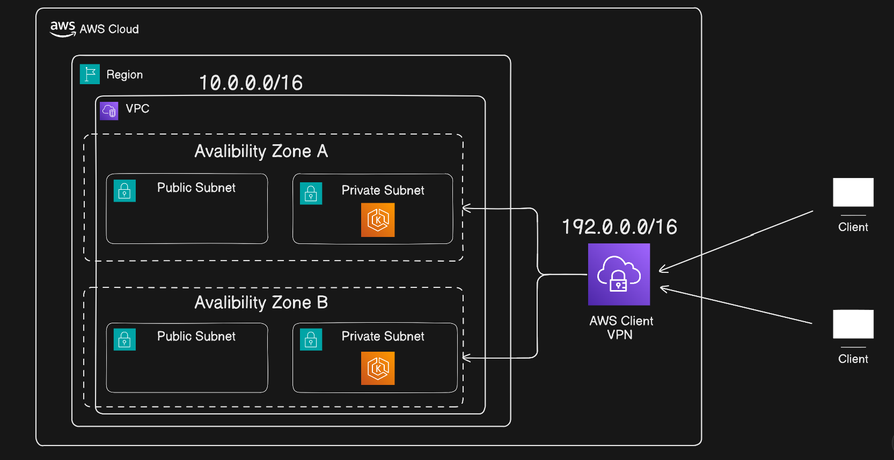

# **Setting up Private EKS with AWS Client VPN (Manual/Console Approach)**

## **Table of Content** 
### 1. [Objective](#objective)
### 2. [Prerequisites](#prerequisites)
### 3. [Architecture Overview](#architecture-overview)
### 4. [Step-by-Step Guide](#step-by-step-guide)
- [Create VPC](#create-vpc)
- [Create Client VPN](#create-client-vpn)
- [Deploy EKS Cluster](#create-eks-in-vpc-with-private-endpoints)
### 5. [Key Takeaways](#key-takeaways)

---

## **Objective**

**In Part 1**, we will:
- Watch demo [video](https://youtu.be/3sIUmDCPrhU?si=Kft4z5GgVtnI2dIm)
- Learn why we need a Private EKS Cluster

- Understand how AWS Client VPN allows secure access to private control plane from external users

- Build the architecture manually via the AWS Console

- Test access to the EKS cluster from a local machine through VPN

This will provide a solid foundation before we move to Terraform automation in Part 2.

## **Prerequisites**

- AWS account with admin access

- Local machine with kubectl and AWS CLI installed

- Basic knowledge of VPC, subnets, and security groups

- Optional: EC2 instance to simulate local machine

## **Architecture Overview**

## **Step-by-Step Guide**
1. ### **Create VPC**
    - Go to AWS Console and serach for VPC
    - Click Create VPC (`choose VPC and more`)
    - Give name to VPC (`ex: project`)
    - Give IPv4 CIDR block (`ex: 10.0.0.0/16`)
    - Number of Availability Zones (`Your preference, choose 2 or more for high avalibility`)
    - Number of public subnets (`Your preference, choose 2 or more for high avalibility`)
    - Number of private subnets (`Your preference, choose 2 or more for high avalibility`)
    - NAT gateways
        - Regional (`only NAT will be created for entire Region`)
        - Zonal (`choose 1 per AZ Nat will be created for each AZs`)
    - VPC endpoints (`choose None`)
    - Finally hit create VPC
    - Complete VPC will be create with public, private subnets, IGW, NAT, Route tables.
2. ### **Create Client VPN**
    - On the left menu scroll down and click `Client VPN Endpoints`
    - Choose setup method `Standard`
    - Give Name and Description (`ex: eks-vpn`)
    - VPC ID (`select vpc id of the one you created`)
    - Endpoint IP address type (`IPv4`)
    - Traffic IP address type (`IPv4`)
    - Client IPv4 CIDR (`ex: 192.0.0.0/16`)
        - Make sure CIDR do not overlap with VPC CIDR
    - Follow this to create Certificates [Doc](https://docs.aws.amazon.com/vpn/latest/clientvpn-admin/client-auth-mutual-enable.html) or Watch [video](https://youtu.be/ImpSlD6LIU8?si=xtNlOAlAN-AmU3d7)
    - Server certificate ARN (`choose: server arn`)
    - Authentication options (`choose: 
Use mutual authentication`)
    - Client certificate ARN (`choose: client arn`)
    - Client interface
        - Client login banner (`check that box`)
        - and Give a message (`This is Welcome message you will get when you connect to VPN`)
    - Connection protocol (`select Split-tunnel`)
    - Once VPN is created (`select the VPN you created`)
    - Go to Target network assocation (`click associate target network`)
    - choose your `VPC id`and `private subnet`
    - Next go to Authorization rule
    - click `add authorization rule`
    - Destation address (`your VPN CIDR ex: 192.0.0.0/16`)
    - Grant access to (`select all users`)
        - you can also select `access group if you have`
    - Last click `Download client configuration`
    - now modify the file that just got downloaded
    - right click and open that file in notepad
    - add `<cert> </cert>` and add client certificate in that tag
    - add `<key> </key>` and add client key in that tag 
    - create a profile and connect to VPN
3. ### **Create EKS in VPC with Private Endpoints**
    - I have already explained how to create a EKS Cluster in our previous video and in folder `EKS-01`
    - In this demo we have our own VPC, so choose `VPC id`, `subnet id` the one you created 

## **Key Takeaways**

- Private EKS endpoint = secure, no public access

- Client VPN provides safe access for remote users

- Always reference VPN SG in EKS SG — cleaner than CIDR

- Private subnets may need NAT for node group image pull

- Routing + authorization rules are critical for connectivity

