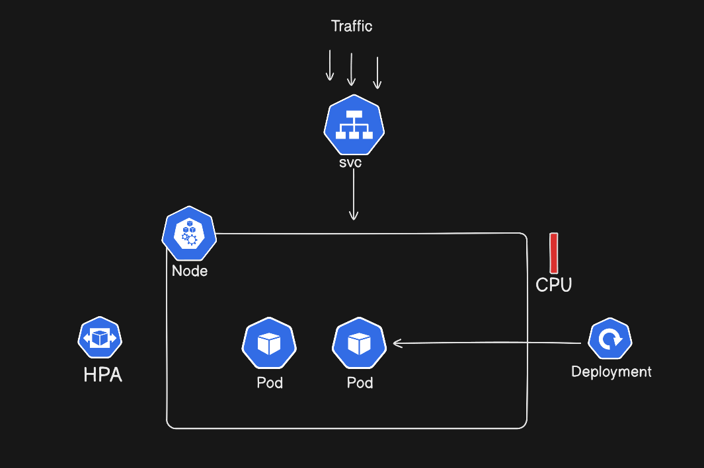

# **EKS Scaling – Cluster Autoscaler (CA)**

In this session, we focus on **Cluster Autoscaler (CA)** and explain **how Kubernetes scales worker nodes in EKS when pods cannot be scheduled**.

---

## 📌 Topics Covered

- Types of scaling in EKS
  - Cluster Autoscaler (CA)
  - Karpenter (intro only)
- Pod creation flow using Deployment
- Kubernetes Scheduler behavior
- Pod `Pending` / `Unschedulable` state
- How Cluster Autoscaler is triggered
- How Auto Scaling Group (ASG) adds EC2 nodes
- End-to-end scaling flow in EKS

---

## Types of Scaling in EKS

### 1. Cluster Autoscaler (CA)
- Works with **Auto Scaling Groups**
- Scales **node groups**, not individual EC2 instances
- Adds or removes nodes based on **unschedulable pods**

### 2. Karpenter (not covered in this video)
- Newer and more dynamic
- Provisions nodes directly instead of relying on ASG

---

## Pod Creation Flow

1. User applies a Deployment: `kubectl apply -f deployment.yaml`
2. Deployment creates a ReplicaSet
3. ReplicaSet creates Pods
4. Pods start in the Pending state

> Creating a pod does not mean it is immediately running.

## Kubernetes Scheduler – How Pods Are Scheduled

The Kubernetes Scheduler is responsible for placing pods on nodes.

Scheduler checks:
- CPU requests
- Memory requests
- Node selectors
- Taints & tolerations
- Affinity rules

**Case 1:** `Node available`
- Pod is scheduled
- Pod state → Running

**Case 2:** `No node available`
- Pod state → Pending
- Pod becomes Unschedulable

**What Does Pending / Unschedulable Mean?**
- Kubernetes tried all nodes
- No node had enough resources
- Scheduler gives up (temporarily)
- Pod stays in Pending state

 At this point, **Cluster Autoscaler comes into action**

## How Cluster Autoscaler Is Triggered
Cluster Autoscaler continuously watches for:
- Pods in Pending state
- Pods marked as Unschedulable
- Pods that can be scheduled if a new node is added

If such pods exist:
- CA decides to scale up a node group

## How Cluster Autoscaler Scales Nodes

- CA identifies the correct node group

- CA updates the Auto Scaling Group (ASG)

- ASG launches new EC2 instances

- New nodes join the EKS cluster

- Scheduler retries pod scheduling

- Pods move from Pending → Running

**Note:** 
- Cluster Autoscaler does not create EC2 instances directly
- It only works through Auto Scaling Groups

