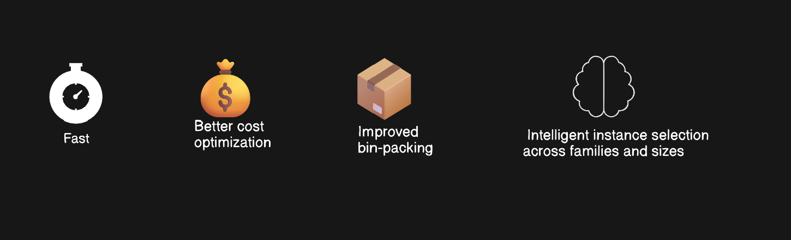
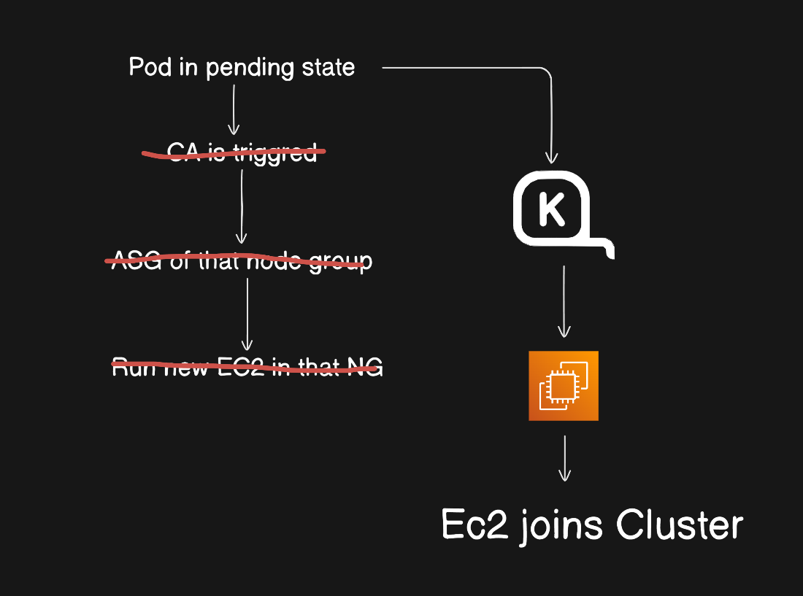

# Karpenter Deep Dive (AWS EKS)

This README provides a complete overview of **Karpenter**, its motivation, architecture, and hands-on usage in AWS EKS. 
---

## Agenda

* Problems with Cluster Autoscaler
* How Karpenter solves these problems
* Benefits of using Karpenter
* Deep dive into Karpenter architecture and workflow

  * Core components (NodePool, EC2NodeClass)
  * End-to-end scaling flow
* Hands-on demo

---

## 1. Problems with Cluster Autoscaler

While Cluster Autoscaler (CA) is stable and widely used, it has several limitations in modern, dynamic workloads:

* **Static instance types**: CA can only launch instance types predefined in node groups
* **Slow scaling**: Depends on Auto Scaling Groups, leading to slower node provisioning
* **Over-provisioning**: Often launches larger or unnecessary nodes
* **Poor bin-packing**: Inefficient resource utilization
* **Complex configuration**: Requires managing multiple node groups for different workloads
* **Limited cost optimization**: No intelligent Spot vs On-Demand decision-making

These challenges become more visible at scale and in cost-sensitive production environments.

---

## 2. How Karpenter Solves These Problems

Karpenter is a **next-generation Kubernetes node autoscaler** built by AWS. Instead of scaling node groups, it directly provisions EC2 instances based on pod requirements.

Key improvements:

* **Dynamic instance selection** (no predefined node groups)
* **Faster scaling** by bypassing ASGs
* **Smart bin-packing** based on real pod needs
* **Automatic cost optimization** (Spot, On-Demand, instance families)
* **Simplified configuration model**

Karpenter reacts directly to unschedulable pods and provisions exactly what is needed.

---

## 3. Benefits of Using Karpenter

* 🚀 Faster node provisioning
* 💰 Better cost optimization
* 📦 Improved bin-packing and utilization
* 🔧 Less infrastructure configuration
* ⚖️ Intelligent instance selection across families and sizes
* ☁️ Native AWS integration



Karpenter is ideal for:

* Spiky workloads
* Batch jobs
* Cost-optimized clusters
* Dynamic production environments

---

## 4. Deep Dive: How Karpenter Works

### 4.1 High-Level Workflow



1. Pod is created
2. Kubernetes scheduler fails to schedule the pod
3. Karpenter detects unschedulable pods
4. Karpenter evaluates pod requirements (CPU, memory, labels, taints, zones)
5. It selects the best EC2 instance type
6. EC2 instance is launched directly
7. Node joins the cluster
8. Pod gets scheduled

---

### 4.2 Core Components

#### NodePool

NodePool defines **how nodes should be created**.

It controls:

* Instance types or constraints
* Capacity type (Spot / On-Demand)
* Zones and architectures
* Taints and labels
* Limits (CPU, memory)

NodePool replaces the need for multiple node groups.

---

#### EC2NodeClass

EC2NodeClass defines **AWS-specific infrastructure settings**.

It includes:

* AMI family
* Subnets
* Security groups
* IAM role
* Block device mappings

This separation keeps infrastructure and scheduling concerns cleanly decoupled.

---

### 4.3 Decision-Making Logic

Karpenter considers:

* Pod resource requests
* Scheduling constraints
* Available instance types
* Pricing and availability
* Spot interruptions

It chooses the **best-fit and lowest-cost instance** at runtime.

---

## 5. Demo Overview

In the demo section, we will:

* Install Karpenter on EKS
* Configure NodePool and EC2NodeClass
* Deploy sample workloads
* Observe node provisioning
* Validate cost and scaling behavior

All resources are provisioned using **Terraform** for full automation.

---

## 6. Cluster Autoscaler vs Karpenter (Quick Summary)

| Feature           | Cluster Autoscaler | Karpenter                |
| ----------------- | ------------------ | ------------------------ |
| Scaling unit      | Node Groups        | Individual EC2 instances |
| Instance types    | Static             | Dynamic                  |
| Speed             | Slower             | Faster                   |
| Cost optimization | Limited            | Advanced                 |
| Configuration     | Complex            | Simple                   |

---


## IAM Roles and Policys to create
- Karpenter Controller Role  `->` used by the Karpenter pod

- Node IAM Role              `->` used by EC2 instances (nodes)

## Add tags to subnets and security groups 
- We need to add tags to our nodegroup subnets so Karpenter will know which subnets to use.


## Install Helm
```
curl -fsSL -o get_helm.sh https://raw.githubusercontent.com/helm/helm/main/scripts/get-helm-3
chmod 700 get_helm.sh
./get_helm.sh
```


## Install CRDs
```
kubectl create namespace "${KARPENTER_NAMESPACE}" || true
kubectl create -f \
    "https://raw.githubusercontent.com/aws/karpenter-provider-aws/v${KARPENTER_VERSION}/pkg/apis/crds/karpenter.sh_nodepools.yaml"
kubectl create -f \
    "https://raw.githubusercontent.com/aws/karpenter-provider-aws/v${KARPENTER_VERSION}/pkg/apis/crds/karpenter.k8s.aws_ec2nodeclasses.yaml"
kubectl create -f \
    "https://raw.githubusercontent.com/aws/karpenter-provider-aws/v${KARPENTER_VERSION}/pkg/apis/crds/karpenter.sh_nodeclaims.yaml"
kubectl apply -f karpenter.yaml

```


## Install karpenter
```
helm template karpenter oci://public.ecr.aws/karpenter/karpenter --version "${KARPENTER_VERSION}" --namespace karpenter \
    --set "settings.clusterName=<Cluster-name>" \
    --set "serviceAccount.annotations.eks\.amazonaws\.com/role-arn=arn:aws:iam::xxxx:role/<Controller-ROLE>" \
    --set controller.resources.requests.cpu=1 \
    --set controller.resources.requests.memory=1Gi \
    --set controller.resources.limits.cpu=1 \
    --set controller.resources.limits.memory=1Gi > karpenter.yaml
```


## NodePool YAML and EC2NodeClass
```
apiVersion: karpenter.sh/v1
kind: NodePool
metadata:
  name: default
spec:
  template:
    spec:
      requirements:
        - key: kubernetes.io/arch
          operator: In
          values: ["amd64"]
        - key: kubernetes.io/os
          operator: In
          values: ["linux"]
        - key: karpenter.sh/capacity-type
          operator: In
          values: ["on-demand"]
        - key: karpenter.k8s.aws/instance-category
          operator: In
          values: ["c", "m", "r"]
        - key: karpenter.k8s.aws/instance-generation
          operator: Gt
          values: ["1"]
      nodeClassRef:
        group: karpenter.k8s.aws
        kind: EC2NodeClass
        name: default
      expireAfter: 720h # 30 * 24h = 720h
  limits:
    cpu: 1000
  disruption:
    consolidationPolicy: WhenEmptyOrUnderutilized
    consolidateAfter: 1m
---
apiVersion: karpenter.k8s.aws/v1
kind: EC2NodeClass
metadata:
  name: default
spec:
  role: "KarpenterNodeRole-dev-eks-demo" # replace with your cluster name
  amiSelectorTerms:
    - alias: "al2023@latest"
  subnetSelectorTerms:
    - tags:
        karpenter.sh/discovery: "dev-eks-demo" # replace with your cluster name
  securityGroupSelectorTerms:
    - tags:
        karpenter.sh/discovery: "dev-eks-demo" # replace with your cluster name
```


## Conclusion

Karpenter represents the future of Kubernetes node scaling on AWS. It removes many of the limitations of Cluster Autoscaler and provides faster, smarter, and more cost-efficient scaling.

This README pairs with the video walkthrough to give both conceptual clarity and hands-on understanding.

---

Happy scaling 🚀
